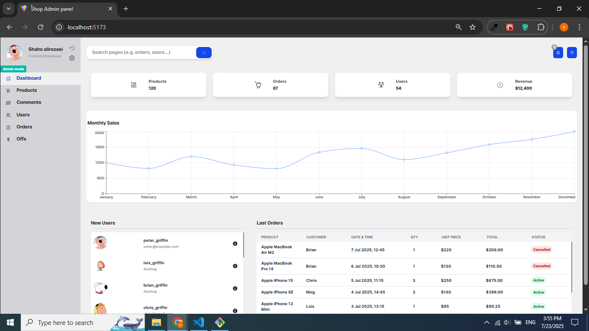
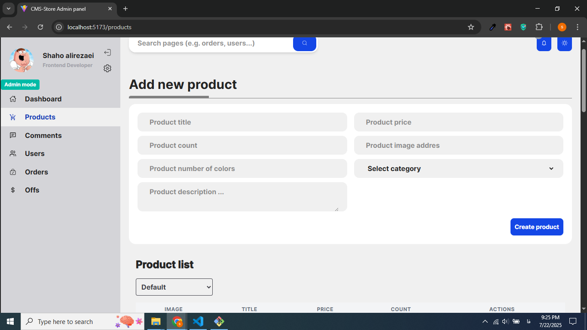
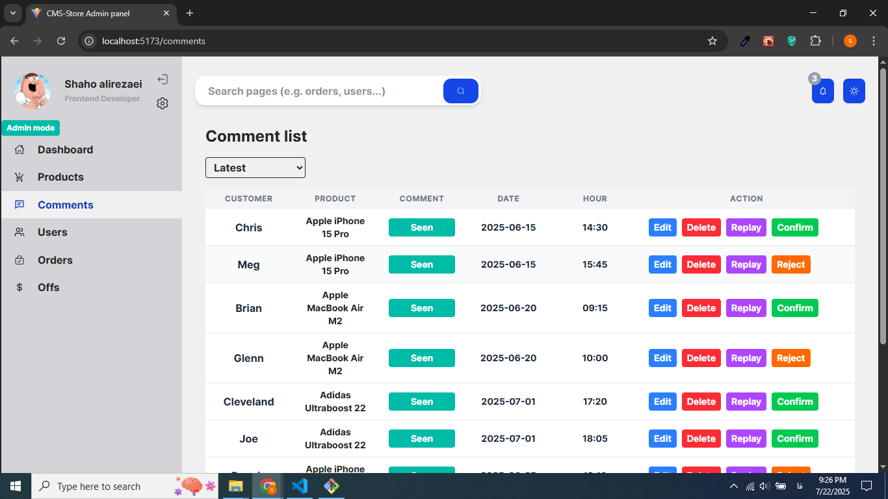
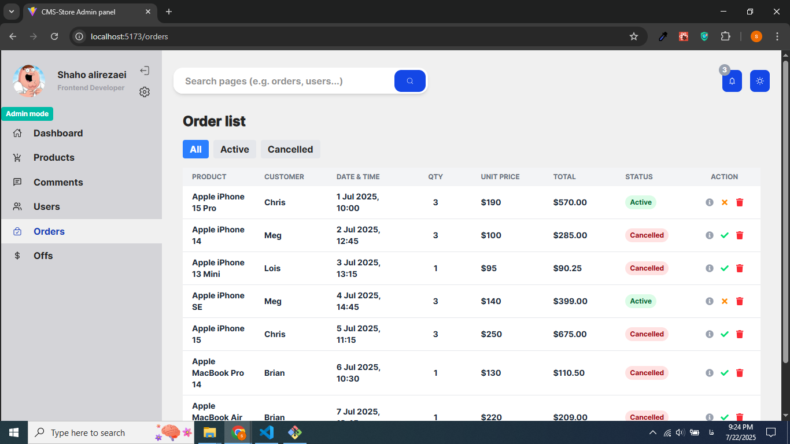
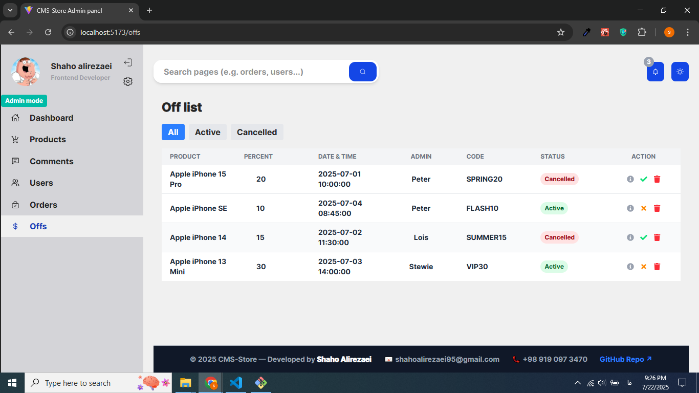
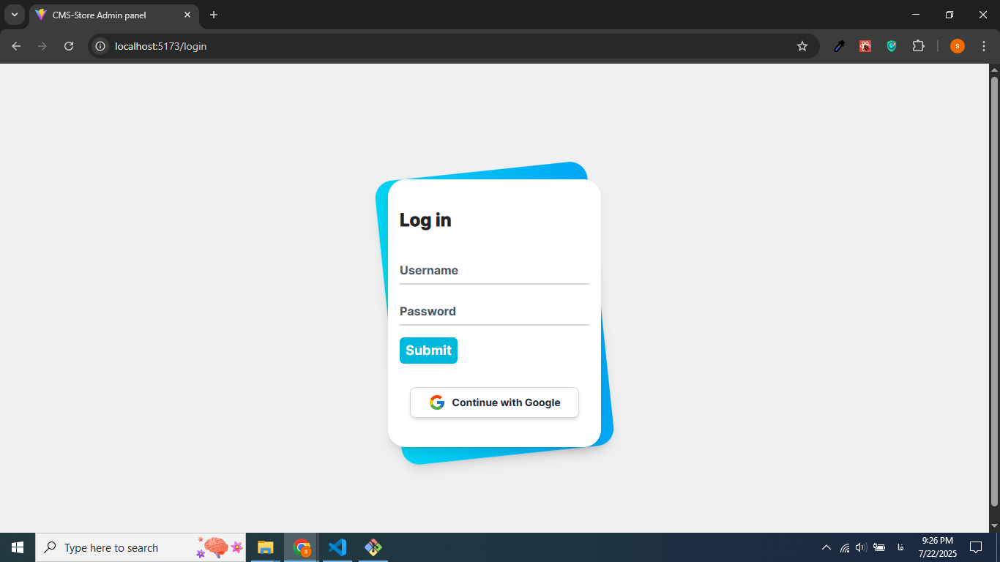
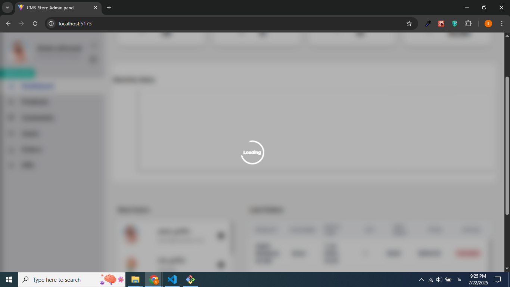
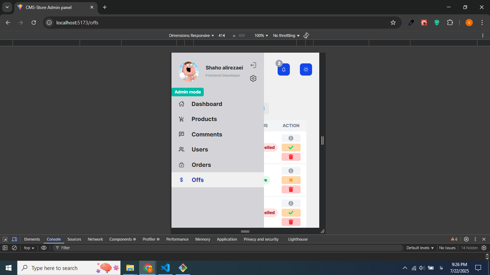
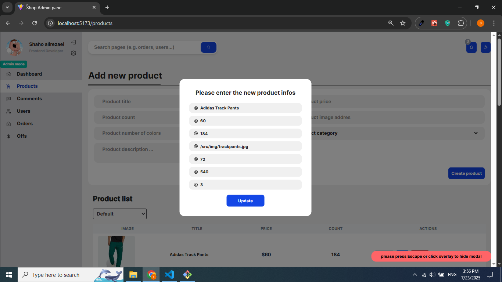

# 🛒 CMS Shop Admin Panel

A modern, fully responsive **Shop Admin Panel**, built using **React (Vite)** for the frontend and **Node.js + Express + MySQL** for the backend.  
This project includes real features like authentication, user roles, product and order management, and interactive UI elements like modals, toasts, and global loaders — all designed to demonstrate solid frontend development skills in a real-world context.


---

## 🚀 Demo

You can view the live project here: [Live Demo](https://your-demo-url.com)


## ⚙️ Tech Stack

### Frontend
- React (with Vite)
- React Router
- Tailwind CSS
- React Toastify
- React Icons
- Context API (for global loading state)

### Backend
- Node.js
- Express.js
- MySQL
- `mysql2` driver
- JWT Authentication
- Role-based access (Admin / Demo)

---

## 📁 Folder Structure

```
cms_shop_vite/
├── backend/         # Node.js + Express + MySQL APIs
└── cms-store/       # React + Tailwind frontend (Vite)
```

---

## ✨ Features

### 🧩 Frontend (React)
- Responsive design using Tailwind CSS
- Product management (Create, Read, Update, Delete)
- Global loading spinner using Context
- Comment moderation (Accept / Reject / Edit / Delete)
- Order management (with Active / Cancelled status filter)
- Add and manage discount codes
- JWT login with role-based access
- User-friendly UI and dark mode support (optional)

### 🧱 Backend (Express + MySQL)
- Secure RESTful APIs
- Authentication with JWT
- Middleware for protected and role-based routes
- Orders, products, users, comments, and discount APIs
- MySQL relational database (via `mysql2`)

---

## 🚀 Getting Started

### 🔧 Prerequisites
- Node.js v18+
- MySQL
- NPM

---

### 📦 Install Dependencies

```bash
# Install frontend dependencies
cd cms-store
npm install

# Install backend dependencies
cd ../backend
npm install
```

---

### ▶️ Run Frontend

```bash
cd cms-store
npm run dev
```

> Local: `http://localhost:5173`

---

### ▶️ Run Backend

```bash
cd backend
node server.js
```

> Local: `http://localhost:8001`

---

### 🗃️ Database Setup

- A MySQL database named `CmsShopDB` is used.
- Tables: `Users`, `Products`, `Orders`, `Comments`, `Offs`
- You can manually create tables or import a dump file (if provided).

---

## 🔐 Roles

- **Admin**: Full access to APIs
- **Demo**: Read-only access to view data

> JWT token is required for protected routes. Token is stored in `localStorage`.

---

## 📸 Screenshots

Here are some snapshots of the CMS Shop panel:












---

## 🧪 API Endpoints 

| Method | Endpoint                              | Description              |
|--------|---------------------------------------|--------------------------|
| POST   | `/api/auth/login`                     | Login user               |
| GET    | `/api/products`                       | Get all products         |
| PUT    | `/api/products/:id`                   | Update product by ID     |
| DELETE | `/api/comments/:id`                   | Delete comment by ID     |
| POST   | `/api/comments/accept/:id`            | Accept comment           |
| PUT    | `/api/orders/active-order/:id/:value` | Set order status         |
| GET   | `/api/monthly-sales`                   | Set order status         |

---

## 📂 File Highlights

| File/Folder                  | Purpose                                |
|-----------------------------|----------------------------------------|
| `cms-store/src/context/`    | Global loading context & provider      |
| `cms-store/src/components/` | UI components (modals, loaders, etc.)  |
| `backend/routes/`           | All Express API routes                 |
| `backend/middleware/`       | Auth & role-based middlewares          |
| `backend/server.js`         | Main entry point of Node.js server     |

---


## 🙋‍♂️ Author

Created by **Shaho Alirezaei** as a junior frontend showcase project.

## 📬 Contact

For questions or job opportunities, feel free to contact me:

- Email: [shahoalirezaei95@gmail.com](mailto:shahoalirezaei95@gmail.com)

Thank you.